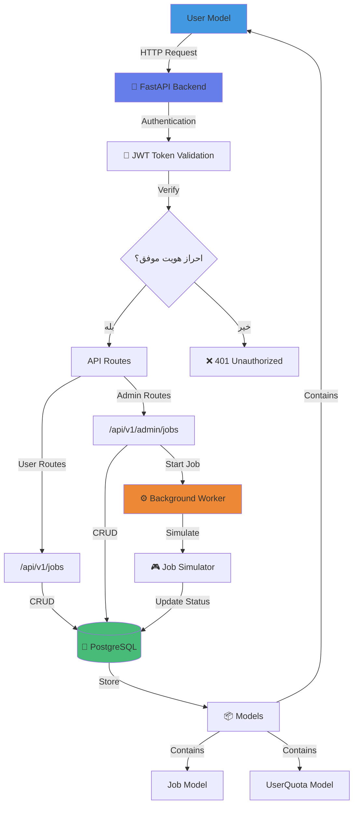
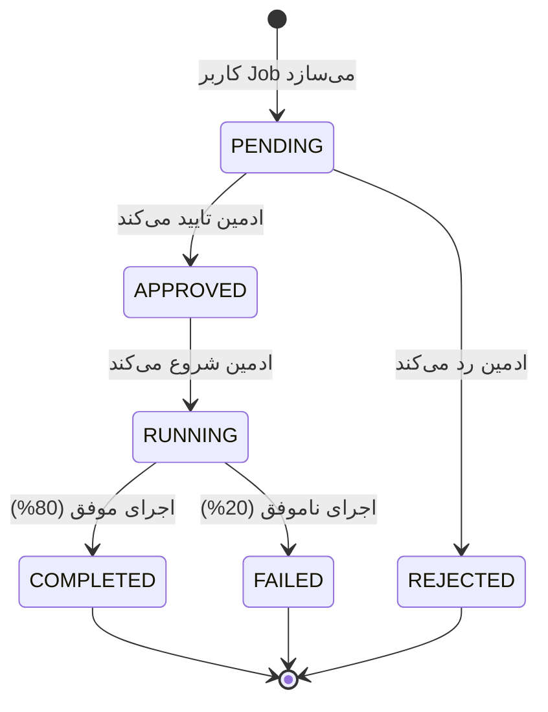
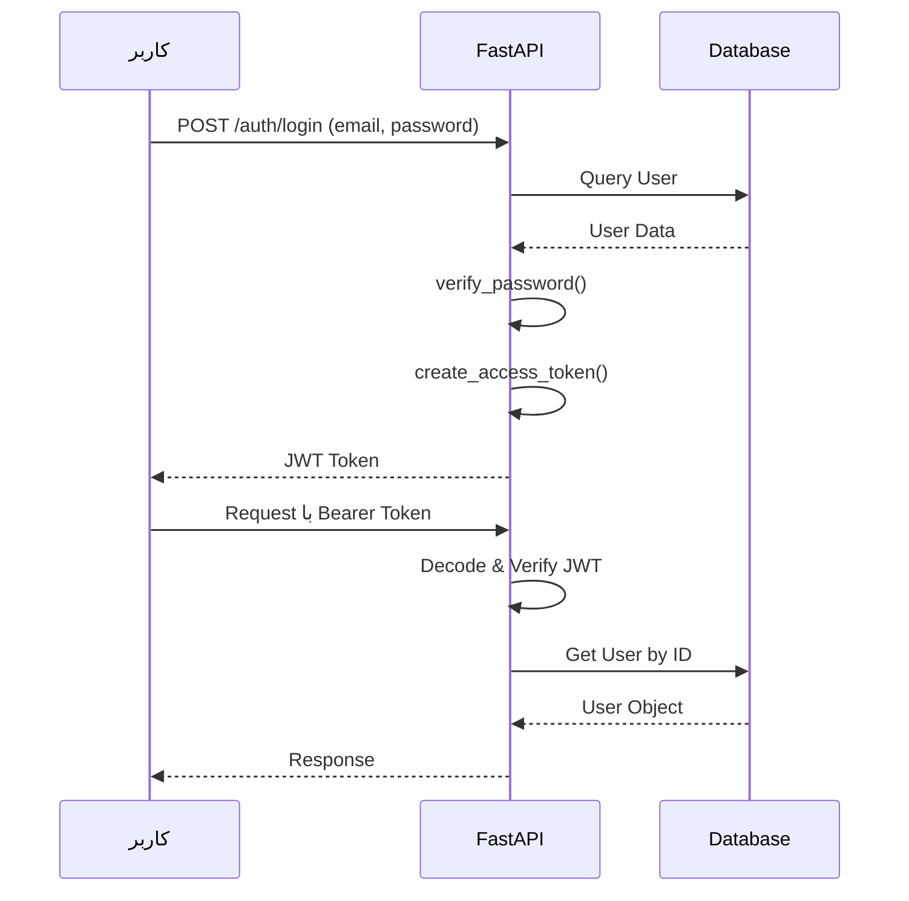
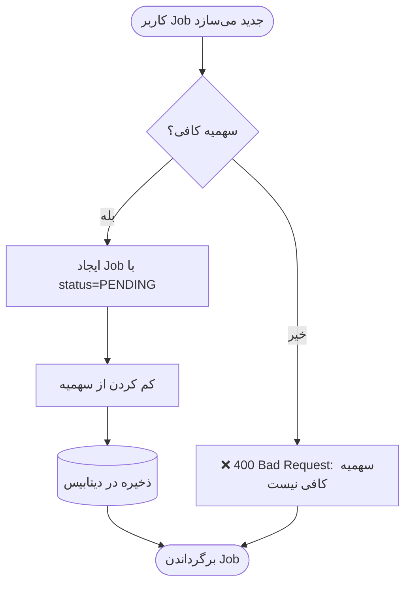
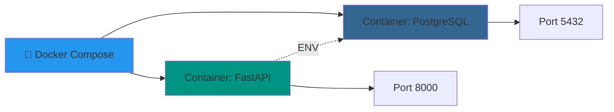

# معماری سیستم GPU as a Service

## نمودار کلی سیستم

## جزئیات لایه‌ها

### 1️⃣ Frontend Layer
- صفحات HTML با Bootstrap
- JavaScript برای ارتباط با API
- صفحات: Login, Register, Dashboard, Admin Panel

### 2️⃣ API Layer (FastAPI)
- **Authentication Routes** (`/api/v1/auth`):
  - POST `/register` - ثبت‌نام کاربر جدید
  - POST `/login` - ورود و دریافت JWT Token

- **User Job Routes** (`/api/v1/jobs`):
  - POST `/` - ایجاد Job جدید
  - GET `/` - لیست Job های کاربر
  - GET `/{id}` - جزئیات یک Job

- **Admin Routes** (`/api/v1/admin/jobs`):
  - POST `/{id}/approve` - تایید Job
  - POST `/{id}/reject` - رد Job
  - POST `/{id}/start` - شروع اجرای Job
  - POST `/{id}/complete` - علامت‌گذاری به عنوان تکمیل شده
  - POST `/{id}/fail` - علامت‌گذاری به عنوان شکست خورده

### 3️⃣ Database Layer
- **PostgreSQL** (نه SQLite!)
- جداول:
  - `users` - اطلاعات کاربران
  - `jobs` - Job های ثبت شده
  - `user_quotas` - سهمیه ماهانه کاربران

### 4️⃣ Background Worker
- استفاده از FastAPI BackgroundTasks
- شبیه‌سازی اجرای Job با time.sleep()
- آپدیت خودکار وضعیت Job

## چرخه حیات Job

## امنیت و احراز هویت

## بررسی سهمیه (Quota Check)

## استقرار (Deployment)

---

## تکنولوژی‌های استفاده شده

| بخش | تکنولوژی | دلیل انتخاب |
|-----|----------|-------------|
| Backend Framework | FastAPI | سریع، مدرن، مستندسازی خودکار |
| Database | PostgreSQL | قدرتمند، production-ready |
| ORM | SQLAlchemy | استاندارد صنعت |
| Authentication | JWT + PyJWT | Stateless, امن |
| Password Hashing | Passlib + bcrypt | امنیت بالا |
| Containerization | Docker + Compose | استقرار آسان |
| Testing | Pytest | استاندارد Python |
| CI/CD | GitHub Actions | اتوماسیون تست |

---

## ویژگی‌های کلیدی

✅ **احراز هویت امن** با JWT  
✅ **تفکیک نقش** User/Admin  
✅ **مدیریت سهمیه** ماهانه GPU  
✅ **چرخه کامل Job** از ثبت تا اجرا  
✅ **شبیه‌سازی واقع‌گرایانه** بدون نیاز به GPU  
✅ **Background Processing** برای Job ها  
✅ **RESTful API** با مستندات Swagger  
✅ **Database Migration** با Alembic  
✅ **Frontend UI** ساده و کاربرپسند  
✅ **Automated Testing** با Coverage  
✅ **Docker Support** برای استقرار آسان  
