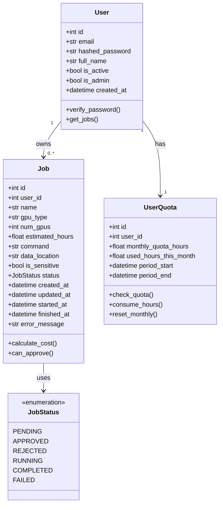
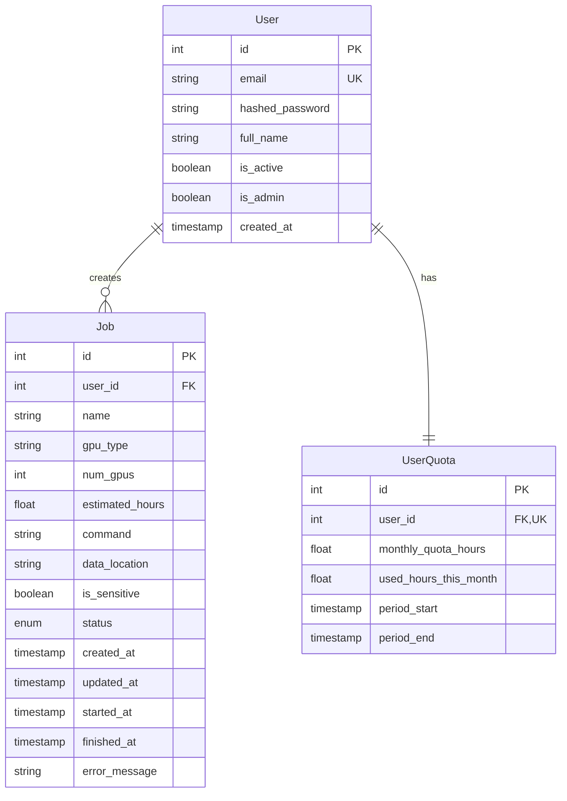
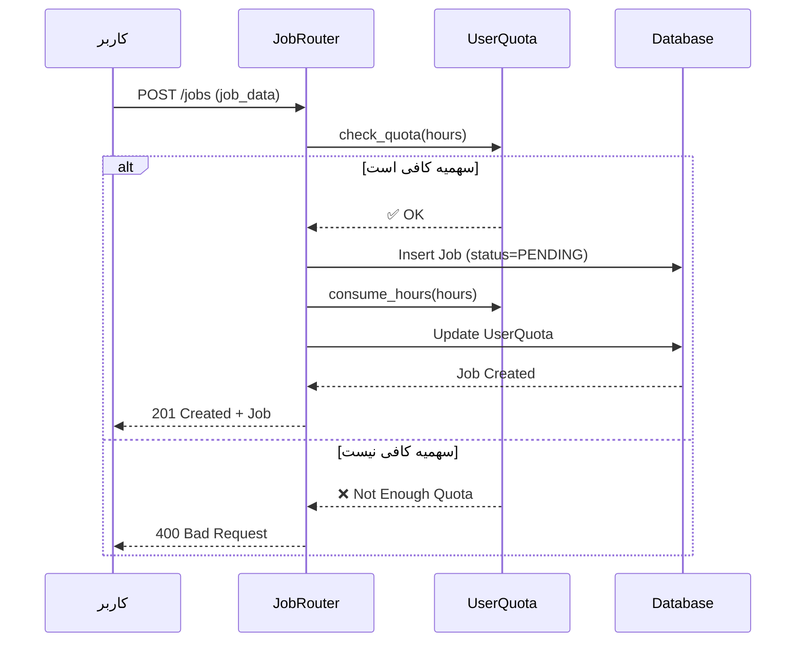
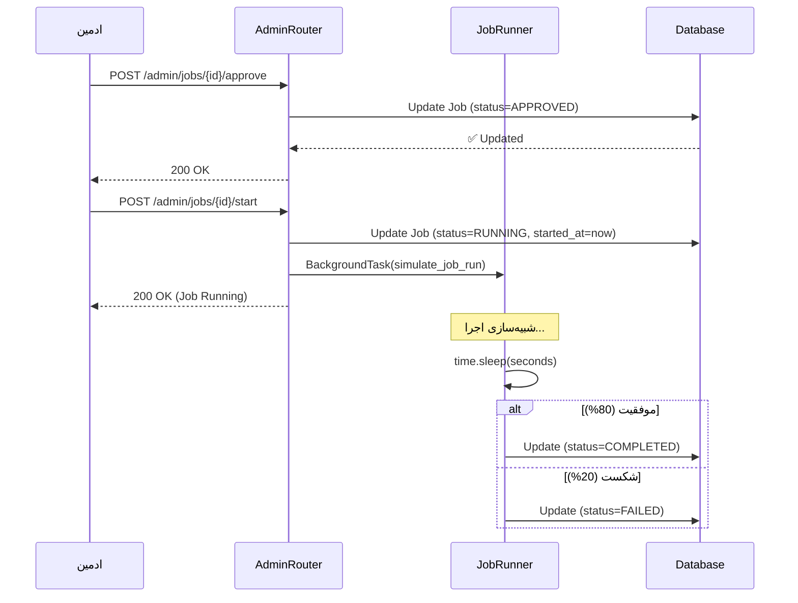

# نمودار کلاس‌های سیستم (UML Class Diagram)

## نمودار اصلی



## توضیحات کلاس‌ها

### 1️⃣ کلاس User (کاربر)

**مسئولیت**: نگهداری اطلاعات کاربران و مدیریت احراز هویت

**فیلدها**:
- `id`: شناسه یکتا
- `email`: ایمیل کاربر (یکتا)
- `hashed_password`: رمز عبور هش شده
- `full_name`: نام کامل
- `is_active`: فعال/غیرفعال
- `is_admin`: آیا ادمین است؟
- `created_at`: تاریخ ثبت‌نام

**متدها**:
- `verify_password()`: بررسی صحت رمز عبور
- `get_jobs()`: دریافت لیست Job های کاربر

**روابط**:
- یک کاربر می‌تواند صفر یا چند Job داشته باشد (1:N)
- یک کاربر دقیقاً یک Quota دارد (1:1)

---

### 2️⃣ کلاس Job (کار)

**مسئولیت**: نگهداری اطلاعات Job ها و مدیریت چرخه حیات آن‌ها

**فیلدها**:
- `id`: شناسه یکتا
- `user_id`: شناسه کاربر مالک
- `name`: نام Job
- `gpu_type`: نوع GPU (مثلاً A100, V100)
- `num_gpus`: تعداد GPU مورد نیاز
- `estimated_hours`: ساعت تخمینی اجرا
- `command`: دستور اجرا
- `data_location`: آدرس داده‌ها (اختیاری)
- `is_sensitive`: آیا حساس است؟
- `status`: وضعیت فعلی
- `created_at`: زمان ایجاد
- `updated_at`: زمان آخرین آپدیت
- `started_at`: زمان شروع اجرا
- `finished_at`: زمان پایان
- `error_message`: پیام خطا (در صورت شکست)

**متدها**:
- `calculate_cost()`: محاسبه هزینه (hours × GPUs)
- `can_approve()`: آیا قابل تایید است؟

**روابط**:
- هر Job متعلق به یک User است (N:1)
- هر Job یک JobStatus دارد (N:1)

---

### 3️⃣ کلاس UserQuota (سهمیه کاربر)

**مسئولیت**: مدیریت سهمیه ماهانه GPU کاربران

**فیلدها**:
- `id`: شناسه یکتا
- `user_id`: شناسه کاربر
- `monthly_quota_hours`: سهمیه ماهانه (ساعت)
- `used_hours_this_month`: مقدار مصرف شده
- `period_start`: شروع دوره
- `period_end`: پایان دوره

**متدها**:
- `check_quota(hours)`: بررسی کفایت سهمیه
- `consume_hours(hours)`: کم کردن از سهمیه
- `reset_monthly()`: ریست ماهانه سهمیه

**روابط**:
- هر Quota متعلق به یک User است (1:1)

---

### 4️⃣ Enum JobStatus (وضعیت Job)

**مقادیر**:
- `PENDING`: در انتظار بررسی ادمین
- `APPROVED`: تایید شده، آماده اجرا
- `REJECTED`: رد شده توسط ادمین
- `RUNNING`: در حال اجرا
- `COMPLETED`: با موفقیت تکمیل شده
- `FAILED`: با خطا تمام شده

---

## نمودار روابط با جزئیات بیشتر



**نکات**:
- PK = Primary Key (کلید اصلی)
- FK = Foreign Key (کلید خارجی)
- UK = Unique Key (یکتا)

---

## نمودار Sequence برای ساخت Job



---

## نمودار Sequence برای اجرای Job



---

## نکات طراحی

### ✅ مزایای طراحی فعلی:
1. **جداسازی مسئولیت‌ها**: هر کلاس یک مسئولیت مشخص دارد
2. **استفاده از Enum**: JobStatus به صورت type-safe
3. **Relationship ها واضح**: SQLAlchemy relationships
4. **Cascade Delete**: حذف User، Job ها و Quota را هم حذف می‌کند
5. **Timestamp ها**: همه تغییرات ثبت می‌شود

### 🔄 قابلیت‌های توسعه آینده:
1. اضافه کردن `JobHistory` برای لاگ تغییرات
2. `PaymentTransaction` برای پرداخت‌ها
3. `GPUResource` برای مدیریت GPU های واقعی
4. `Notification` برای اطلاع‌رسانی به کاربران

---

## SQL Schema (تولید شده از Models)

```sql
-- جدول کاربران
CREATE TABLE users (
    id SERIAL PRIMARY KEY,
    email VARCHAR(255) UNIQUE NOT NULL,
    hashed_password VARCHAR(255) NOT NULL,
    full_name VARCHAR(255),
    is_active BOOLEAN DEFAULT TRUE,
    is_admin BOOLEAN DEFAULT FALSE,
    created_at TIMESTAMP WITH TIME ZONE DEFAULT NOW()
);

-- جدول Job ها
CREATE TABLE jobs (
    id SERIAL PRIMARY KEY,
    user_id INTEGER REFERENCES users(id) ON DELETE CASCADE,
    name VARCHAR(255) NOT NULL,
    gpu_type VARCHAR(50) NOT NULL,
    num_gpus INTEGER DEFAULT 1,
    estimated_hours FLOAT DEFAULT 1.0,
    command TEXT NOT NULL,
    data_location TEXT,
    is_sensitive BOOLEAN DEFAULT FALSE,
    status VARCHAR(20) DEFAULT 'PENDING',
    created_at TIMESTAMP WITH TIME ZONE DEFAULT NOW(),
    updated_at TIMESTAMP WITH TIME ZONE DEFAULT NOW(),
    started_at TIMESTAMP WITH TIME ZONE,
    finished_at TIMESTAMP WITH TIME ZONE,
    error_message TEXT
);

-- جدول سهمیه‌ها
CREATE TABLE user_quotas (
    id SERIAL PRIMARY KEY,
    user_id INTEGER UNIQUE REFERENCES users(id) ON DELETE CASCADE,
    monthly_quota_hours FLOAT DEFAULT 10.0,
    used_hours_this_month FLOAT DEFAULT 0.0,
    period_start TIMESTAMP WITH TIME ZONE DEFAULT NOW(),
    period_end TIMESTAMP WITH TIME ZONE
);

-- ایندکس‌ها برای بهبود کارایی
CREATE INDEX idx_jobs_user_id ON jobs(user_id);
CREATE INDEX idx_jobs_status ON jobs(status);
CREATE INDEX idx_users_email ON users(email);
```

---

این نمودارها نشان می‌دهند که پروژه شما با اصول **SOLID** و **Clean Architecture** طراحی شده است.
